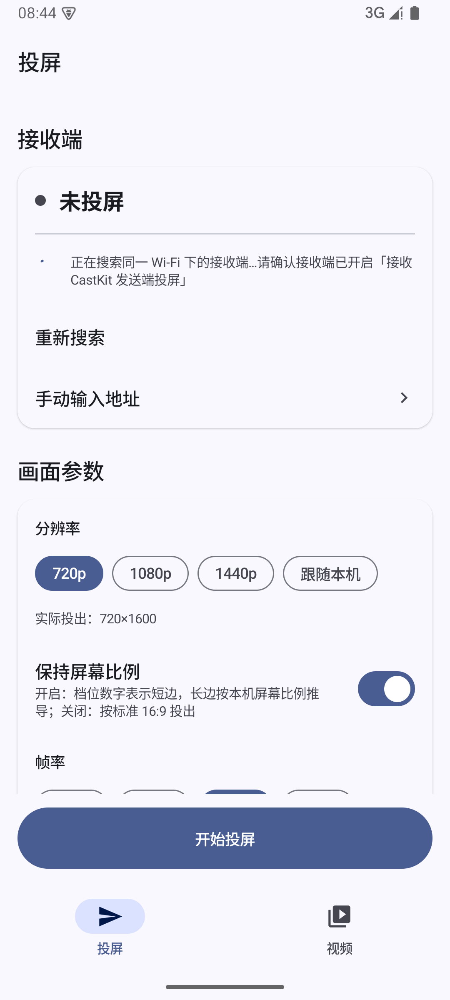
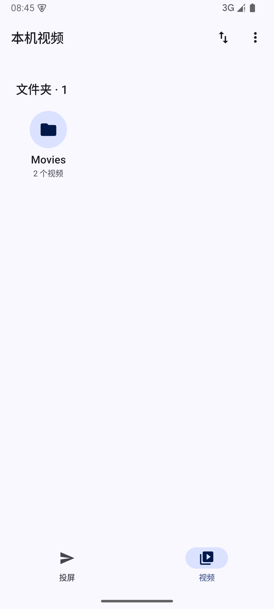
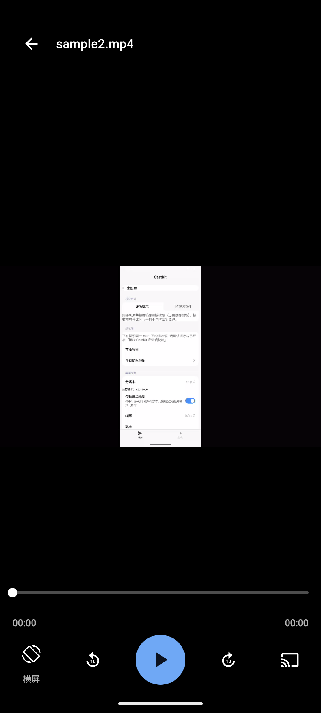

# CastKit —— 安卓投屏接收端 + 配套发送端

把一个 Android 设备变成投屏接收端：**iPhone / iPad / Mac 直接用系统「屏幕镜像」（AirPlay）投过来；
安卓设备装配套发送端投过来**。接收端支持目标分辨率 / 最大帧率 / 过扫描设置，界面适配手机、平板、
横竖屏与画中画。

```
iPhone / iPad / Mac ──AirPlay（原生）───────────────┐
                                                    │
Android + CastKit 发送端 ──LANCast v1（TCP/H.264）──┼─ → 接收端 App ──→ 全屏播放
                                                    │
Android + CastKit 发送端 ──HTTP 原始视频文件────────┘   （「投视频文件」：接收端原生播放器直取原文件）
```

---

## 下载

| 文件 | 装在 | 大小 |
|---|---|---|
| [`CastKit-Sender-1.0.0-debug.apk`](https://github.com/THO48/castkit/releases/download/v1.0.0/CastKit-Sender-1.0.0-debug.apk) | **发送端** —— 要投出去的设备 | 16.0 MB |
| [`CastKit-Receiver-0.0.31-castkit.1-debug.apk`](https://github.com/THO48/castkit/releases/download/v1.0.0/CastKit-Receiver-0.0.31-castkit.1-debug.apk) | **接收端** —— 显示画面的设备 | 37.6 MB |

全部版本见 [Releases](https://github.com/THO48/castkit/releases)。

**安装前必读**

- 两个包都是 **debug 构建**。发送端要出正式签名版需要发布密钥托管；接收端因为构建环境缺少
  NDK/CMake **无法重新打包**，现有产物就是 debug 版。debug 包可直接安装使用，但它**不能和以后
  正式签名的包互相覆盖升级**（届时需先卸载）。
- 接收端**只含 `arm64-v8a`** 原生库（OpenSSL / FFmpeg / UxPlay 内核），只能装在 arm64 设备上。
- 发送端含 `arm64-v8a / armeabi-v7a / x86 / x86_64` 四种 ABI。
- 需要先在系统设置里允许「安装未知来源应用」。

| | minSdk | targetSdk |
|---|---|---|
| 发送端 | Android 8.0 (API 26) | 36 |
| 接收端 | Android 7.0 (API 24) | 36 |

---

## 界面

发送端 UI **全部基于 Material 3**（`androidx.compose.material3`，无第三方 UI 组件库），
并配有一套完整设计系统：颜色 / 字体 / 形状 / 间距 Token、**每一对前景-背景组合的 WCAG 2.1 实测
对比度**、三页线框与逐条偏差记录 → [`docs/DESIGN-SYSTEM.md`](docs/DESIGN-SYSTEM.md)。

| 投屏设置页 | 文件列表页 | 视频播放器 |
|---|---|---|
|  |  |  |

深色模式、组件画廊、窄屏 Chip 溢出、端到端投送等更多截图见 [`docs/screenshots/`](docs/screenshots)；
其中 [`before-after/`](docs/screenshots/before-after) 保留了改造前的旧界面用于对照。

---

## 目录

| 路径 | 说明 |
|---|---|
| `sender/` | 发送端 App（`com.dsh.castkit.sender`），自研，Jetpack Compose + Material 3 |
| `receiver/` | 接收端 App（`com.dsh.castkit.receiver`），fork 自 [jqssun/android-airplay-server](https://github.com/jqssun/android-airplay-server)（GPL-3.0，UxPlay 内核），Compose + Material 3 |
| `flutter_sender/` | 早期的 Flutter 发送端原型，见 [`docs/FLUTTER.md`](docs/FLUTTER.md) |
| `docs/DESIGN-SYSTEM.md` | **发送端设计系统**：Token、WCAG 实测矩阵、线框、偏差清单 |
| `docs/ARCHITECTURE.md` | 整体架构与模块划分 |
| `docs/BUILD.md` | 构建说明（含离线镜像与 aarch64 宿主兼容方案） |
| `docs/LANCast-v1.md` | 自研投屏协议（发送端 → 接收端） |
| `docs/TESTING.md` | 验收 / 测试矩阵 |
| `docs/THIRD_PARTY.md` | 第三方组件与许可 |
| `docs/screenshots/` | 界面截图（改造前后、三页、组件、端到端） |
| `tools/` | 环境与构建脚本 |

---

## 构建

**发送端**（不需要原生工具链，Windows / Linux / macOS 都可以直接构建）：

```bash
cd sender
./gradlew :app:assembleDebug          # 产物：sender/app/build/outputs/apk/debug/app-debug.apk
```

**接收端**需要 Android NDK + CMake（要交叉编译 OpenSSL 与最小 FFmpeg），本机没有的话请走容器路径。

**容器内一键构建**（完整流程，见 [`docs/BUILD.md`](docs/BUILD.md)）：

```bash
bash tools/fetch-sources.sh        # 取原生依赖源码（走 gitclone/gitcode 镜像）
bash tools/patch-sources.sh        # 离线化补丁（OpenSSL 本地源码、Gradle 镜像、UxPlay 枚举移植）
bash tools/setup-host-compat.sh    # aarch64 宿主兼容（qemu 跑 aapt2、NDK 工具换本机 clang）
bash tools/build-receiver.sh       # 产出接收端 APK（内部会预构建 OpenSSL + 最小 FFmpeg）
bash tools/build-sender.sh         # 产出发送端 APK
bash tools/install-apk.sh receiver # 导出到 Download/DSHA 供安装
```

首次构建耗时较长（OpenSSL 3.4.4 + 最小 FFmpeg + UxPlay 交叉编译，约 20–45 分钟），之后增量构建 1–2 分钟。

---

## 功能

### 接收端

- AirPlay 屏幕镜像（H.264/H.265 硬解）+ 音频（AAC-ELD/AAC-LC/ALAC）
- AirPlay 视频/音乐播放（HLS）、PIN 配对、Android TV 遥控器操作、画中画
- 目标分辨率（自动 / 720p / 1080p / 1440p / 4K / 自定义宽高）与最大帧率、过扫描开关
- 局域网投屏接收（LANCast v1，来自 CastKit 发送端）
- **投视频文件接收**：播放发送端共享的原视频文件（系统原生播放器，独立全屏播放页，
  播放/暂停、进度条、退出，按视频自身比例显示）
- 调试叠加层：实时分辨率/码率/FPS

### 发送端

**投屏**

- MediaProjection 采集 + MediaCodec H.264 编码
- 分辨率 `720p / 1080p / 1440p / 跟随本机`，帧率 `15 / 24 / 30 / 60`，码率 1–20 Mbps
- **保持屏幕比例**：开启时档位数字表示**短边**、长边按本机屏幕比例推导（不变形）；
  关闭时按标准 16:9 字面值投出（会被拉伸）。这个开关对**所有档位**生效
- **自动搜索接收端**（UDP 广播，无需手输 IP；AP 隔离时可展开「手动输入地址」兜底）
- 断线自动重连（最多 3 次），前台服务 + 通知停止

**视频库**

- **底部导航分「投屏」「视频」两页**：投屏页管设备与参数，视频页管内容
- **内置视频库 + 播放器**：点视频**直接在本应用内播放**（不是只选中）；不想给读视频权限时可用
  「系统文件选择器」兜底。浏览器支持：
  - **按目录层级浏览**：默认只列最上级文件夹，进去才看到子文件夹与其中的视频（含子目录统计）
  - **排序**：按时间 / 名称 / 文件大小 / 视频时长，各支持正序与倒序，设置会记住
  - **预览大小**：四档可调，文件夹与视频分别控制每行个数（默认文件夹 3 列、视频 2 列）
  - **.nomedia 目录**：可选显示（这些目录 MediaStore 不索引，需要「所有文件访问」权限）

**投视频文件**

- 只把选中的视频通过局域网 HTTP（带 `Range`，端口 8130）交给接收端，接收端用系统原生播放器
  直接播原文件 —— 原始画质、有声音、可拖进度，**不需要录屏授权**

**播放页**

- 底部控制区五格：`切到横/竖屏` · `后退 10 秒` · `播放/暂停` · `前进 10 秒` · `投屏`
- 进度条为自绘的 **3dp 细轨 + 12dp 圆形滑块**；点击画面切换控制栏显隐，3 秒无操作自动隐藏
- **切到横/竖屏**：只改本机方向，接收端画面方向不受影响（镜像投屏会据 `localPlayerActive`
  停止跟随本机旋转）
- **投屏**：弹出设备列表，**点设备名立即开投**（无需再点一次「开始投屏」）；开投后本机自动暂停，
  避免手机与接收端同时出声
- **投送中播放页变成遥控器**：本机画面隐藏，换成「正在投送到 <设备名>」的沉浸态；进度条/时长/
  播放状态全部来自接收端（每秒回报），拖动进度条即同步 seek，播放/暂停也控制接收端；
  停止投送后本机进度自动对齐到接收端停下的位置
- **收尾成对**：退出播放页 = 结束投送；接收端自己退出/播完，发送端 8 秒内也会自动结束投送

**发送端代码结构**

单 Activity + Compose；三个页面各配一个 ViewModel（`CastViewModel` / `BrowserViewModel` /
`PlayerViewModel`）做状态提升，但**进程级状态**（`CastBus`、`VideoLibraryCache`、缩略图缓存、
设备发现）仍留在单例里，由 ViewModel 订阅而非持有。文件列表页的内容状态收敛成
`LibraryUiState`（`Loading / Empty / Content(refining)`），权限是独立维度；
投屏页与播放页保留各自的领域状态机（`CastPhase` / `LocalPlaybackState`）。

---

## 已知限制

- 普通非 root App **无法**接收 Miracast（系统「无线投屏」）与 Google Cast 镜像：前者需要平台签名权限
  `CONFIGURE_WIFI_DISPLAY`，后者需要 Google 认证的接收设备证书。因此安卓侧必须安装配套发送端 App。
- iOS 端码率由 iPhone 按网络自决，接收端只能指定分辨率/帧率（UxPlay 的 `-s/-fps` 机制）；
  真正可自定义码率的是安卓发送端。
- AirPlay 的 DRM 内容（如 Apple TV App）不支持。
- 接收端仅构建/验证 **arm64-v8a**。
- **发送端的「自定义分辨率」档位已移除**：分辨率只保留 `720p / 1080p / 1440p / 跟随本机` 四档
  （见 [`docs/DESIGN-SYSTEM.md`](docs/DESIGN-SYSTEM.md) 的偏差清单）。接收端的「自定义宽高」不受影响。
- 内置视频库需要 `READ_MEDIA_VIDEO`（Android 13+）才能扫描；拒绝时仍可用系统文件选择器。
- 显示 `.nomedia` 目录需要「所有文件访问」权限（`MANAGE_EXTERNAL_STORAGE`）：这些目录 MediaStore
  完全不索引，只能靠文件系统遍历，Android 11+ 上没这个权限读不到。这类条目的时长与缩略图不在媒体库里，
  由 `MediaMetadataRetriever` / `ThumbnailUtils` 直接读文件得到（界面按需补探 + 少量批量预探）。
- **缩略图三级缓存**：内存 LRU → 磁盘缓存（`cacheDir/thumb_cache`，800 张上限、LRU 淘汰）→ 现抽帧；
  同时**限制并发解码为 2**、条目滚出屏幕即中断抽帧（`CancellationSignal`），所以快速拖动不会因
  一秒内冒出十几个抽帧任务而卡顿。
- **打开速度**：媒体库查询（快）与 `.nomedia` 遍历（慢）分两段——先出内容，再在后台补扫描；
  `.nomedia` 结果落磁盘缓存（5 分钟有效，手动「刷新」强制重扫），另有一份进程内缓存供切页复用。
  所以重开应用基本是"秒出"，不会每次都等全盘扫描。
- 「投视频文件」模式要求接收端能直接访问发送端的 HTTP 地址（同一 Wi-Fi、未被 AP 隔离）；
  能播哪些格式取决于**接收端**系统播放器；投送期间发送端要保持运行（前台服务）。
- 镜像模式下两端屏幕比例不同必然留黑边（例如 20:9 手机 → 3:2 平板）：镜像的是"整块屏幕"，
  要么留边、要么裁切。看视频请用「投视频文件」，它按视频自身比例播放。

---

## 贡献者

- **THO48** —— 发起与维护
- **[DeepSeek](https://github.com/deepseek-ai)** —— 发送端 v1.0.0 UI 重构的模型与推理
- **DSH（DeepSeek Harness）** —— 上述工作的编码代理运行环境

完整说明见 [`CONTRIBUTORS.md`](CONTRIBUTORS.md)。

---

## 许可

- `sender/`：本仓库自研代码。
- `receiver/`：**GPL-3.0**（继承 UxPlay / playfair 逆向实现的许可），详见其目录下的 `LICENSE`。
- 第三方组件与许可汇总见 [`docs/THIRD_PARTY.md`](docs/THIRD_PARTY.md)。
