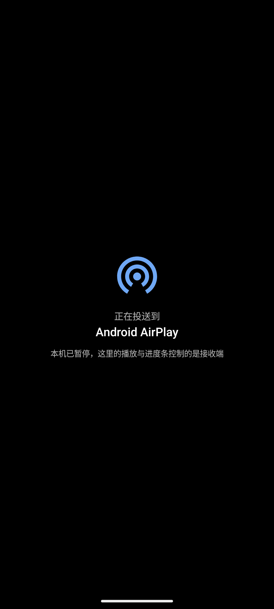

# CastKit

**把一台 Android 设备变成投屏接收端。** iPhone / iPad / Mac 用系统自带的「屏幕镜像」（AirPlay）直接投过来；
安卓设备装配套发送端投过来 —— 既能镜像整屏，也能把手机里的视频文件原画质投过去。

```
iPhone / iPad / Mac ──AirPlay（原生）───────────────┐
                                                    │
Android + CastKit 发送端 ──LANCast v1（TCP/H.264）──┼─ → 接收端 App ──→ 全屏播放
                                                    │
Android + CastKit 发送端 ──HTTP 原始视频文件────────┘   （「投视频文件」：接收端直取原文件播放）
```

| 接收端（平板 / 电视盒子 / 旧手机） | 发送端（手机） |
|---|---|
|  |  |

播放页（两端同一套界面）：

| 控制栏展开 | 投送中（本机变遥控器） |
|---|---|
|  |  |

深色模式、组件画廊、窄屏溢出、端到端投送等更多截图见 [`docs/screenshots/`](docs/screenshots)。

---

## 下载与安装

当前版本 **v1.0.0**（本仓库的版本基线）：

| 文件 | 装在哪 | 大小 |
|---|---|---|
| [`CastKit-Sender-1.0.0-debug.apk`](https://github.com/THO48/castkit/releases/download/v1.0.0/CastKit-Sender-1.0.0-debug.apk) | **发送端** —— 要投出去的设备 | 239.3 MB |
| [`CastKit-Receiver-1.0.0-debug.apk`](https://github.com/THO48/castkit/releases/download/v1.0.0/CastKit-Receiver-1.0.0-debug.apk) | **接收端** —— 显示画面的设备 | 82.0 MB |

| | minSdk | targetSdk | 原生 ABI |
|---|---|---|---|
| 发送端 | Android 8.0 (API 26) | 36 | arm64-v8a / armeabi-v7a / x86 / x86_64 |
| 接收端 | Android 7.0 (API 24) | 36 | **仅 arm64-v8a** |

**安装前必读**

- 两个包都是 **debug 构建**。可以直接安装使用，但它**不能和以后正式签名的包互相覆盖升级**
  （届时需先卸载再装）。
- 接收端只含 `arm64-v8a` 原生库（OpenSSL / FFmpeg / UxPlay 内核 + libVLC），**只能装在 arm64 设备上**。
- 发送端四种 ABI 齐全；包体大是因为两端都内置了 libVLC（每个 ABI 的 `libvlc.so` 约 46 MB），
  用来兜住 WMV/ASF 这类系统解不了的片源。包体不是约束，所以**没有裁剪 ABI**。
- 需要先在系统设置里允许「安装未知来源应用」。
- 要看到 `.nomedia` 目录、以及 `.vob` / `.rmvb` 这类媒体库不收录的文件，需要授予**「所有文件访问」权限**。
- **版本号重新基线过一次**：本版是 `1.0.0`（`versionCode` 也从 1 起算）。装过旧版 `v1.0.x`
  的设备需要**先卸载再装**，否则系统会以「版本更旧」为由拒绝安装。

**快速上手**

1. 接收端设备装 `CastKit-Receiver-1.0.0-debug.apk`，打开即开始广播。
2. iOS：控制中心 →「屏幕镜像」→ 选这台设备。安卓：装发送端 → 「视频」页选片 → 播放页点「投屏」→ 点设备名。

---

## 功能

### 播放页（两端同一套界面与手势）

接收端的「投视频文件」播放页和发送端的本机播放页是**同一套视觉与交互**：顶栏/底栏全透明、
白字白图标带投影、自绘 `3dp` 细轨 + `12dp` 圆形滑块、3 秒自动收起、系统栏跟着控制栏显隐、
矮屏（可用高度 < 480dp）自动换紧凑档。

| 手势 | 动作 |
|---|---|
| 点击画面 | 切换控制栏显隐（单击会等一个双击超时，约 300ms） |
| **双击左 1/3** | ⏪ 后退 10 秒 |
| **双击中间 1/3** | 播放 / 暂停 |
| **双击右 1/3** | ⏩ 前进 10 秒 |
| **左右滑** | **边滑边跳**调进度：一整屏宽 = 片长的 1/3，并且**滑得越快跨得越多**（位移按速度加权，慢滑 1×、快甩最多 4×） |
| 长按画面 | `3×` 快进，松手立刻回 1×（仅发送端本机播放时） |
| 左半屏上下滑 | 调**系统亮度**（无级，退出不还原） |
| 右半屏上下滑 | 调**系统音量**（无级，退出不还原） |

跳转后画面中央会闪一下「箭头 + 目标时间 + 偏移量」（如 `⏪ 00:38 −00:10`），0.7 秒后自己消失；
竖滑时是「图标 + 进度条 + 百分比」。发送端在**投送态**整个关掉横滑与大部手势 —— 那时它只是一块遥控面板。

### 投屏接收端

- **AirPlay 屏幕镜像**（H.264 / H.265 硬解）+ 音频（AAC-ELD / AAC-LC / ALAC），PIN 配对、
  画中画、Android TV 遥控器操作
- **AirPlay 视频 / 音乐播放**（HLS）
- 目标分辨率（自动 / 720p / 1080p / 1440p / 4K / 自定义宽高）、最大帧率、过扫描开关
- **局域网投屏接收**（LANCast v1，来自 CastKit 发送端）：镜像整屏，或**投视频文件**——
  直接播发送端共享的原文件，原画质、有声音、可拖进度
- **可以主动断开投屏**：播放页顶栏右侧的「断开投屏」（返回箭头、系统返回键、这个按钮是同一个动作）
  会一边停本机播放，一边通知发送端**立刻收尾**（协议里的 `EXT_STOP` 反向消息），
  不用等对面 8 秒的状态超时
- 调试叠加层：实时分辨率 / 码率 / FPS

### 发送端

**投屏**

- MediaProjection 采集 + MediaCodec H.264 编码；分辨率 `720p / 1080p / 1440p / 跟随本机`，
  帧率 `15 / 24 / 30 / 60`，码率 1–20 Mbps
- **保持屏幕比例**：开启时档位数字表示**短边**、长边按本机屏幕比例推导（不变形）；关闭则按 16:9 字面值投出
- **自动搜索接收端**（UDP 广播，无需手输 IP；AP 隔离时可手动输入地址兜底），断线自动重连
- 前台服务 + 通知停止

**视频库与播放器**

- **底部导航分「投屏」「视频」两页**：投屏页管设备与参数，视频页管内容
- **内置视频库 + 播放器**：点视频直接在本应用内播放；不给读视频权限时可用「系统文件选择器」兜底
- 按目录层级浏览、四档排序（时间 / 名称 / 大小 / 时长，正倒序，设置会记住）、四档预览大小
- **媒体库不收录的格式也列得出来**：`.vob` / `.rmvb` 这类文件 MediaStore 根本不收
  （前者只进 `Files` 表且 MIME 是 `application/octet-stream`，后者压根不入库），
  文件系统补扫按扩展名把它们捞回来、与媒体库按路径去重后并入列表，同样有缩略图、时长与分辨率
- **系统解析不了的片源也有时长和预览图**：`.wmv` 在媒体库里 `duration` / `width` / `height` 是 `NULL`
  （`.mpg` 有分辨率没时长），缩略图也生成不出来 —— 这类条目按需交给 libVLC 补（`Media.parse()`
  取时长分辨率，把画面渲染进 `ImageReader` 取预览图），结果确定性缓存、不反复重探
- **缩略图三级缓存**：内存 LRU → 磁盘缓存（800 张上限）→ 现抽帧；并发解码限 2、条目滚出屏幕即中断
- **打开速度**：媒体库查询（快）与 `.nomedia` 遍历（慢）分两段，先出内容再后台补扫

**投送**

- 只把选中的视频通过局域网 HTTP（带 `Range`，端口 8130）交给接收端，**不需要录屏授权**
- **投送中本机变成遥控器**：本机画面收起，换成「正在投送到 <设备名>」的沉浸态；
  进度条 / 时长 / 播放状态全部来自接收端（每秒回报），播放暂停、±10 秒、拖动进度条都作用在接收端
- **投送结束本机接着播**：不管是谁结束的（本机点停止投送、接收端主动断开、接收端 8 秒没回报），
  都把本机进度对齐到接收端最后回报的位置并**接着播**；只有接收端已经播到结尾附近时才对不播
- **每部视频记住播放进度**：看到一半退出（甚至被杀进程）下次打开**从上次的位置接着播**，
  进页提示「已从上次的 00:39 继续播放」；**看到结尾就忘掉**，下次从头播。
  文件列表里看过一半的视频，**缩略图正下方有一条很窄的橙色进度条**，一眼看出哪些看过、看到哪了。
  投送带过去的起始进度就是它 —— 手机上看到 12 分钟再投屏，接收端也从 12 分钟开始

### 实现要点

- **播放三引擎**：Media3 ExoPlayer 为主，NextLib 提供 FFmpeg 软解兜底（部分片源 Media3 自己就会路由过去），
  容器仍不认识时交给 libVLC（它自带 FFmpeg 解封装，覆盖 ASF/WMV/WMA）
- **播放器不挂在主线程**：两端播放器各跑在自己的 `HandlerThread` 上（`ExoPlayer.Builder.setLooper`）。
  Media3 会把渲染器回调投递到播放器所在的 Looper，而新版里这类回调是**逐帧**的、
  每个都要读播放位置（拿播放器内部锁 + 走时间线）—— 挂在主线程上时，长片退出播放页会为了排完积压
  单帧耗时 2 秒。判定过程见 `debug/MainThreadWatchdog`（帧统计看不到主线程阻塞）
- **投视频文件的协议**：发送端 HTTP 暴露文件（支持 `Range`），接收端直取播放；
  控制通道是 TCP 8123 上的 `LANCast v1`（心跳、遥控、状态回报、断开通知）→ [`docs/LANCast-v1.md`](docs/LANCast-v1.md)
- **发送端 UI 全部基于 Material 3**，配一套完整设计系统：颜色 / 字体 / 形状 / 间距 Token、
  **每一对前景-背景组合的 WCAG 2.1 实测对比度**、三页线框与逐条偏差记录
  → [`docs/DESIGN-SYSTEM.md`](docs/DESIGN-SYSTEM.md)

---

## 已知限制

- 普通非 root App **无法**接收 Miracast（系统「无线投屏」）与 Google Cast 镜像：前者需要平台签名权限
  `CONFIGURE_WIFI_DISPLAY`，后者需要 Google 认证的接收设备证书。因此安卓侧必须安装配套发送端 App。
- iOS 端码率由 iPhone 按网络自决，接收端只能指定分辨率 / 帧率（UxPlay 的 `-s/-fps` 机制）；
  真正可自定义码率的是安卓发送端。
- AirPlay 的 DRM 内容（如 Apple TV App）不支持。
- 接收端仅构建 / 验证 **arm64-v8a**。
- 镜像模式下两端屏幕比例不同必然留黑边（例如 20:9 手机 → 3:2 平板）：镜像的是「整块屏幕」，
  要么留边、要么裁切。看视频请用「投视频文件」，它按视频自身比例播放。
- 「投视频文件」要求接收端能直接访问发送端的 HTTP 地址（同一 Wi-Fi、未被 AP 隔离）；
  能播哪些格式取决于**接收端**的解码能力；投送期间发送端要保持运行（前台服务）。
- 内置视频库需要 `READ_MEDIA_VIDEO`（Android 13+）才能扫描；拒绝时仍可用系统文件选择器。
- 显示 `.nomedia` 目录、列出 `.vob` / `.rmvb`，都需要「所有文件访问」权限（`MANAGE_EXTERNAL_STORAGE`）——
  Android 11+ 上没有这个权限读不到，属平台限制。
- 无级调亮度 / 音量受平台限制：音量接口只吃整数档，档位少的机器会一格一格跳。
- 发送端「自定义分辨率」档位已移除，只保留 `720p / 1080p / 1440p / 跟随本机` 四档
  （接收端的「自定义宽高」不受影响）。

---

## 构建

**发送端**（不需要原生工具链，Windows / Linux / macOS 都能直接构建）：

```bash
cd sender
./gradlew :app:assembleDebug          # 产物：sender/app/build/outputs/apk/debug/app-debug.apk
```

**接收端**需要 Android NDK + CMake（要交叉编译 OpenSSL 与最小 FFmpeg）。容器内一键构建：

```bash
bash tools/fetch-sources.sh        # 取原生依赖源码（走镜像）
bash tools/patch-sources.sh        # 离线化补丁（OpenSSL 本地源码、Gradle 镜像、UxPlay 枚举移植）
bash tools/setup-host-compat.sh    # aarch64 宿主兼容（qemu 跑 aapt2、NDK 工具换本机 clang）
bash tools/build-receiver.sh       # 产出接收端 APK（内部会预构建 OpenSSL + 最小 FFmpeg）
bash tools/build-sender.sh         # 产出发送端 APK
```

首次构建耗时较长（OpenSSL + 最小 FFmpeg + UxPlay 交叉编译，约 20–45 分钟），之后增量 1–2 分钟。
完整说明（含离线镜像、aarch64 宿主兼容方案）见 [`docs/BUILD.md`](docs/BUILD.md)。

---

## 文档

| 文档 | 内容 |
|---|---|
| [`docs/ARCHITECTURE.md`](docs/ARCHITECTURE.md) | 整体架构、数据流、排查通道 |
| [`docs/DESIGN-SYSTEM.md`](docs/DESIGN-SYSTEM.md) | 设计系统：Token、WCAG 实测矩阵、线框、偏差清单 |
| [`docs/BUILD.md`](docs/BUILD.md) | 构建说明（离线镜像、容器内一键构建） |
| [`docs/TESTING.md`](docs/TESTING.md) | 验收 / 测试矩阵（逐条可执行） |
| [`docs/LANCast-v1.md`](docs/LANCast-v1.md) | 自研投屏协议（发送端 ↔ 接收端） |
| [`docs/THIRD_PARTY.md`](docs/THIRD_PARTY.md) | 第三方组件与许可 |
| [`docs/FLUTTER.md`](docs/FLUTTER.md) | 早期 Flutter 发送端原型的记录 |

---

## 仓库结构

| 路径 | 说明 |
|---|---|
| `sender/` | 发送端 App（`com.dsh.castkit.sender`），自研，Jetpack Compose + Material 3 |
| `receiver/` | 接收端 App（`com.dsh.castkit.receiver`），fork 自 [jqssun/android-airplay-server](https://github.com/jqssun/android-airplay-server)（GPL-3.0，UxPlay 内核） |
| `docs/` | 上表那些文档 + `screenshots/` |
| `tools/` | 环境与构建脚本 |
| `patches/` | 原生依赖的离线化补丁 |
| `flutter_sender/` | 早期的 Flutter 发送端原型 |

---

## 版本

本仓库的版本基线是 **`1.0.0`**：`main` 上的历史经过一次整理，版本号、`versionCode`
与 Release 都从 `1.0.0` 重新起算（此前 `v1.0.0`–`v1.0.11` 的 Release 与 tag 已移除，
对应的旧 APK 也不再提供）。后续改动直接从 `1.0.1` 往上走。

---

## 贡献者

<p>
<a href="https://github.com/THO48"></a>
&nbsp;&nbsp;
<a href="https://github.com/deepseek-ai"></a>
</p>

- **[THO48](https://github.com/THO48)** —— 发起与维护
- **[DeepSeek](https://github.com/deepseek-ai)** —— 发送端 UI 重构的模型与推理
- **DSH（DeepSeek Harness）** —— 上述工作的编码代理运行环境

完整说明见 [`CONTRIBUTORS.md`](CONTRIBUTORS.md)。

---

## 许可

- `sender/`：本仓库自研代码；但**分发时整体按 GPL-3.0 处理**（含 GPL-3.0 的 `nextlib-media3ext`），
  另含 LGPL-2.1 的 libVLC。
- `receiver/`：**GPL-3.0**（继承 UxPlay / playfair 逆向实现的许可），详见其目录下的 `LICENSE`；
  另含 LGPL-2.1 的 libVLC。
- 第三方组件与许可汇总见 [`docs/THIRD_PARTY.md`](docs/THIRD_PARTY.md)。
